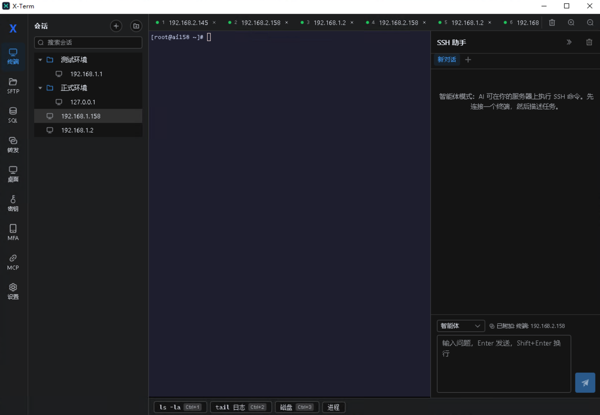

# X-Term

> 一站式运维工作站 —— SSH 终端、SFTP 文件管理、MySQL 数据库、远程桌面、AI 智能助手，全部在一个应用里。

---

## 📖 产品简介

X-Term 是一款面向运维工程师和开发者的 **现代化桌面运维客户端**。它将日常运维所需的核心工具整合到一个应用中，无需在多个软件之间来回切换。

<!-- 产品主截图 -->


### 你可以用它来做什么？

- 🔗 **连接服务器**：SSH / Telnet 多标签终端，像浏览器一样管理多个会话
- 📁 **传输文件**：SFTP 双栏文件管理，拖拽上传、断点续传
- 🗄️ **操作数据库**：MySQL 命令行控制台，语法高亮、自动补全、结果导出
- 🖥️ **远程桌面**：一键启动 RDP / VNC 连接 Windows 或 Linux 桌面
- 🤖 **AI 运维助手**：用自然语言描述任务，AI 帮你执行命令、查数据库（你确认后才执行）

---

## ✨ 核心功能

### SSH / Telnet 终端

多标签终端，支持会话分组管理。右键菜单（复制/粘贴/搜索/清屏），选中即复制，Ctrl+F 终端搜索，连接断开一键重连。

<!-- 终端截图 -->


### SFTP 文件管理

本地 / 远程双栏浏览，拖拽上传，面包屑导航，列排序，多文件批量传输，传输进度实时显示。

<!-- SFTP 截图 -->


### MySQL 数据库控制台

类 mysql CLI 命令行模式（回车执行、历史保留），或切换到代码模式（多行编辑器 + 结果表格）。左侧数据库树（实例 → 库 → 表），点击表名自动补全字段，结果可导出 CSV / JSON。

<!-- SQL 截图 -->


### 远程桌面（RDP / VNC）

独立管理 RDP（Windows 远程桌面）和 VNC 连接，一键启动系统自带客户端。密码加密存储，安全可靠。

<!-- 桌面截图 -->


### AI 智能助手

SSH 侧和数据库侧各有独立的 AI 助手面板。支持多模型（OpenAI / Claude / DeepSeek / 智谱等），智能体模式下 AI 可以：
- 在服务器上执行命令（你确认后才执行）
- 在数据库上执行 SQL（写操作需二次确认）
- 命令白名单自动放行，危险操作强制人工确认

<!-- AI 截图 -->


### 密钥管理

统一的密钥保险库，密码 / 私钥加密存储（AES-256-GCM），主密码保护。支持添加、查看、重命名、删除。

### 端口转发

本地转发（-L）、远程转发（-R）、动态 SOCKS5（-D），规则持久化、按需启停。

---

## 📥 下载安装

### 方式一：安装包（推荐）

1. 下载 `X-Term_x.x.x_x64-setup.exe`
2. 双击运行，按提示安装
3. 从开始菜单或桌面快捷方式启动

> 适用于 Windows 10 / 11（64 位）

### 方式二：从源码构建

详见下方 [构建指南](#-构建指南)。

---

## 🚀 快速开始

### 1. 首次启动

首次打开会提示设置主密码（用于加密保存你的服务器密码、私钥等凭据）。请牢记主密码，丢失后无法找回。

<!-- 首次启动截图 -->


### 2. 添加 SSH 连接

1. 点击左侧 **终端** → 会话树上方 **新建会话**
2. 填写名称、主机、端口、用户名
3. 选择认证方式（密码 / 私钥）
4. 保存后双击连接

<!-- 新建会话截图 -->


### 3. 使用 AI 助手

1. 打开 **设置 → AI 助手**，添加你的 API Key
2. 回到终端页，右侧 AI 面板切换到 **智能体** 模式
3. 输入「看看这台机器磁盘使用情况」，AI 会自动执行 `df -h`

---

## 🔨 构建指南

### 环境要求

| 依赖 | 版本 |
|---|---|
| Node.js | 18+ |
| pnpm | 9+ |
| Rust | 1.77+ |
| Visual Studio 2022 | 含 C++ 桌面开发工作负载 |

### 构建步骤

```bash
# 1. 安装依赖
pnpm install

# 2. 构建安装包（Windows）
scripts\build.bat
```

产物位于 `src-tauri/target/release/bundle/nsis/`。

> **注意**：构建脚本会加载 MSVC 环境并强制使用 cl.exe 编译器，避免 MinGW 链接冲突。请勿在未加载 VS 环境的情况下直接 `cargo build`。

### 开发模式

```bash
scripts\dev.bat
```

启动热更新开发服务器，修改代码后自动刷新。

---

## 📂 截图说明

截图文件放在 `docs/screenshots/` 目录下：

| 文件 | 内容 |
|---|---|
| `main.png` | 产品主界面（终端 + AI 面板） |
| `terminal.png` | SSH 终端多标签 |
| `sftp.png` | SFTP 双栏文件管理 |
| `sql.png` | MySQL 命令行控制台 |
| `desktop.png` | 远程桌面管理 |
| `ai.png` | AI 智能助手面板 |
| `first-run.png` | 首次启动（主密码设置） |
| `new-session.png` | 新建会话对话框 |

> 添加截图后放入对应路径即可，README 会自动引用。

---

## 📄 技术文档

详细的技术架构、模块设计、数据模型等信息，请参阅 [技术设计文档](TECHNICAL_DESIGN.md)。

---

## 📜 License

MIT
